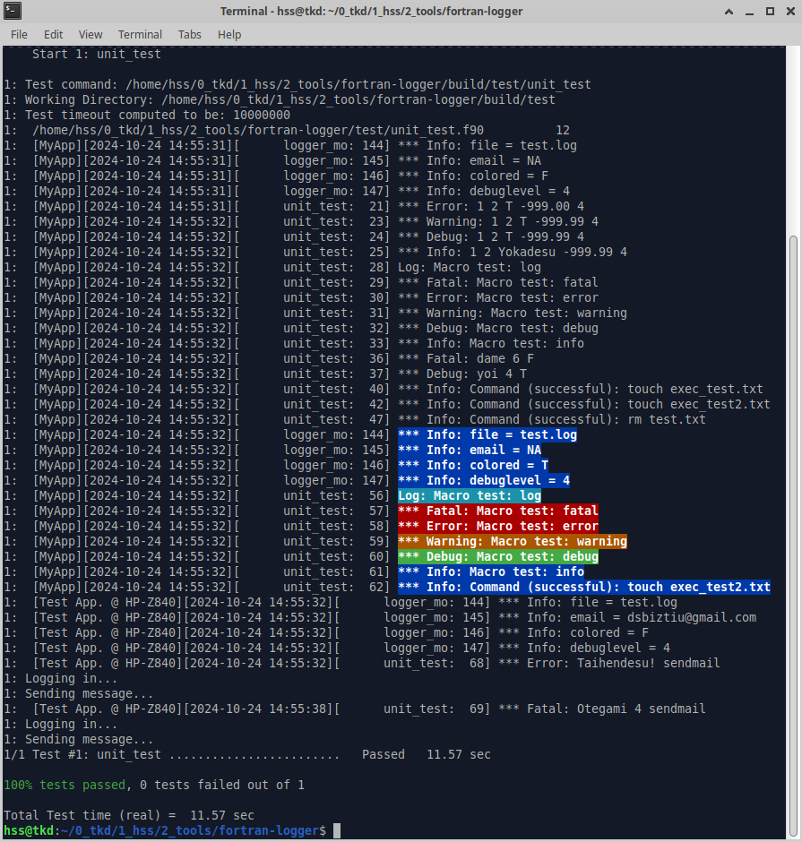

# fortran-logger

A Simple Logger for Fortran

- ANSI coloring on terminal {Fatal, Error, Warn, Debug, Info}
- Multi-threaded
- Email capability with "sendmail" argument

## Usage


- Initialization

```
  call logger%init ( file = 'test.log' )
```

- Logging with a message

```
  __ERROR__( 'Sorry to bother you!' )

```

- Logging with multiple arguments ( with paste function )

```
  i = 1
  __FATAL__( paste( 'Not good!', i+2, .false., 0.2 ) )

```

- Execute command line with logging

```
  __EXEC__( 'touch test.txt' )
```

- Open file with logging

```
  call logger%open ( __FILE__, __LINE__, newunit = u, file = 'test.txt', status = 'old' )
```

- Email

With a "sendmail" argument, log email will be sent.\
Please replace MUA (I use neomutt) name to yours in logger_mo.f90.

```
  call logger%init ( file = 'test.log', app = 'Test App. @ HP-Z840', debuglevel = 4, email = 'dsbiztiu@gmail.com' )
  __ERROR__( paste( 'Taihendesu!', 'sendmail' ) )
```

- logger derived type

```
  type logger_ty
    character(255) :: file       = 'NA'    ! Log file path
    character(255) :: app        = 'MyApp' ! Application name
    character(255) :: email      = 'NA'    ! Email address
    character(255) :: args       = 'NA'    ! Debug arguments
    logical        :: colored    = .false. ! Use ANSI terminal colors
    integer        :: debuglevel = 1       ! Debug level (0: No logging)
  contains
    procedure :: init  => init_logger
    procedure :: write => write_log
    procedure :: open  => open_file_with_logger
    procedure :: exec  => execute_with_logger
  end type
```

- Output Image

[test/unit_test.f90]


